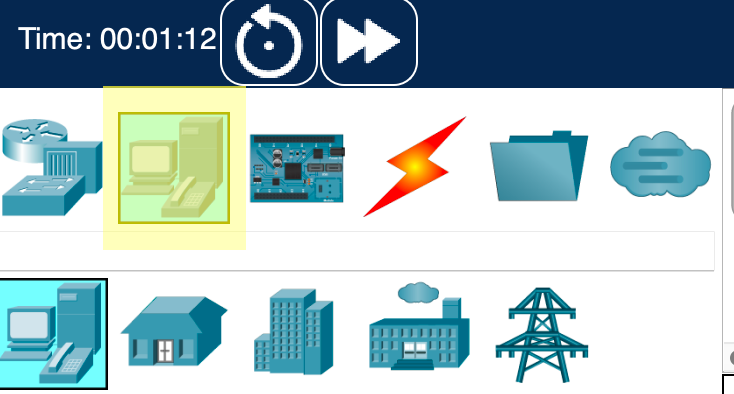
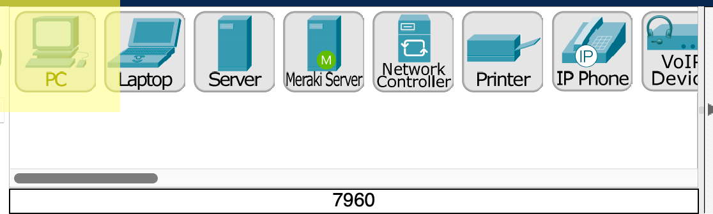
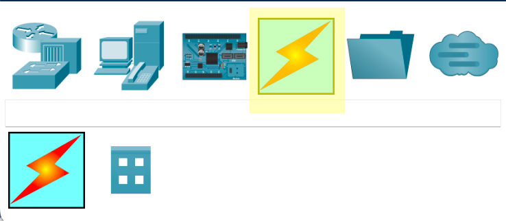
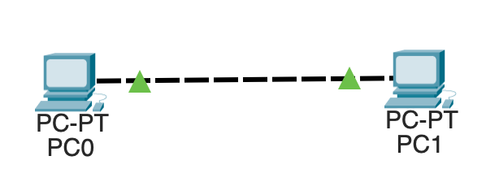

# Dự án: Packet Tracer: Kết Nối Hai Máy Tính

Trong dự án này, ta sẽ xây dựng một mạng đơn giản giữa hai máy tính
bằng công cụ [fl[Packet
Tracer|https://www.netacad.com/courses/packet-tracer]] của Cisco. Miễn phí!

Nếu bạn chưa cài, xem phần [Phụ lục: Packet
Tracer](#appendix-packettracer) để biết thông tin cài đặt.

Nếu ở bất kỳ thời điểm nào bạn mắc lỗi cần xóa, hãy chọn công cụ
"Delete" từ hàng icon thứ hai phía dưới.

## Thêm Máy Tính Vào LAN

Chọn "End Devices" phía dưới bên trái.



Sau đó kéo hai "PC" ra vùng làm việc từ panel ở giữa phía dưới.



## Nối Dây Hai PC Trực Tiếp

Bây giờ bạn đã có hai PC trong workspace (không gian làm việc), hãy
nối dây chúng lại.

Click vào icon "Connections" ở góc dưới bên trái.



Click vào icon "Copper Cross-Over" ở giữa phía dưới. (Icon sẽ đổi
thành ký hiệu "anti".)


Click vào một trong hai PC. Chọn "FastEthernet0".

Click vào PC còn lại. Chọn "FastEthernet0".

Bây giờ bạn sẽ thấy cái gì đó như thế này:



## Cài Đặt Mạng IP

Cả hai máy tính chưa có địa chỉ IP. Ta sẽ cài đặt cho chúng IP tĩnh
theo ý mình.

1. Click vào PC0.

2. Click tab "Config".

3. Click "FastEthernet0" trong sidebar.

4. Cho "IPv4 Address" (địa chỉ IPv4), nhập `192.168.0.2`.

5. Cho "Subnet Mask" (mặt nạ mạng con), nhập `255.255.255.0`.

Đóng cửa sổ cấu hình.

Click vào PC1 và thực hiện tương tự, nhưng nhập `192.168.0.3` cho địa
chỉ IP. Đóng cửa sổ cấu hình khi xong.

## Ping Qua Mạng

Hãy ping từ PC0 đến PC1 để đảm bảo mạng đã kết nối.

1. Click vào PC0. Chọn tab "Desktop".

2. Click vào "Command Prompt".

3. Trong command prompt, gõ `ping 192.168.0.3`.

> Khi ping, lần ping đầu tiên có thể timeout (hết giờ) vì ARP cần
> làm việc trước. Trong các mạng phức tạp hơn, nhiều ping có thể
> timeout trước khi thông.

Bạn sẽ thấy output ping thành công:

``` {.sh}
C:\>ping 192.168.0.3

Pinging 192.168.0.3 with 32 bytes of data:

Reply from 192.168.0.3: bytes=32 time<1ms TTL=128
Reply from 192.168.0.3: bytes=32 time<1ms TTL=128
Reply from 192.168.0.3: bytes=32 time<1ms TTL=128
Reply from 192.168.0.3: bytes=32 time<1ms TTL=128

Ping statistics for 192.168.0.3:
    Packets: Sent = 4, Received = 4, Lost = 0 (0% loss),
Approximate round trip times in milli-seconds:
    Minimum = 0ms, Maximum = 0ms, Average = 0ms
```

Nếu bạn thấy `Request timed out.` nhiều hơn hai lần, có gì đó bị
cài sai.

## Lưu Dự Án

Nhớ lưu dự án. Nó sẽ lưu file với phần mở rộng `.pkt`.

<!-- Rubric

5
Crossover cable used

5
Two PCs used

5
PCs set up with correct IP addresses.

5
PCs can ping one another.

-->
