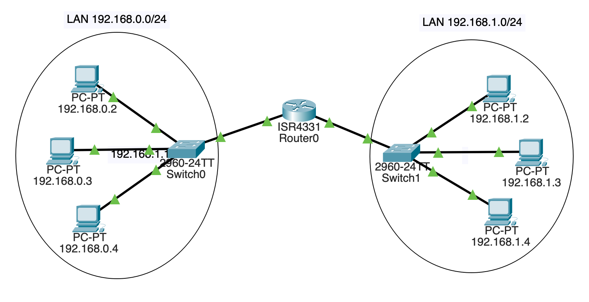

# Dự án: Packet Tracer: Dùng Router

Ta sẽ thêm một router giữa hai mạng độc lập trong Packet Tracer.

Mục tiêu là xây dựng thứ trông như thế này:

## Xây Dựng Các LAN

Trước tiên, xây dựng hai LAN riêng biệt. Mỗi cái có ba PC và một
switch 2960 như trước.

Subnet bên trái sẽ là `192.168.0.0/24`. Subnet bên phải sẽ là
`192.168.1.0/24`.

Gán cho các PC bên trái địa chỉ IP trên interface `FastEthernet0`:

* `192.168.0.2`
* `192.168.0.3`
* `192.168.0.4`

Gán cho các PC bên phải địa chỉ IP trên interface `FastEthernet0`:

* `192.168.1.2`
* `192.168.1.3`
* `192.168.1.4`

Tất cả đều có subnet mask `255.255.255.0`.

Kết nối các PC bên trái vào một switch trên bất kỳ cổng `FastEthernet`
nào còn trống. Kết nối các PC bên phải vào switch còn lại theo cách
tương tự.

Lúc này bạn đã có hai LAN riêng biệt.

Nhấn nút tua nhanh nếu tất cả các link chưa xanh. Nếu chúng vẫn đỏ,
có gì đó sai --- kiểm tra lại cài đặt.

Để chắc ăn, hãy đảm bảo `192.168.0.2` có thể ping hai máy còn lại
trên LAN của nó. Và đảm bảo `192.168.1.3` có thể ping hai máy còn lại
trên LAN của nó.

## Thêm Router

Router sẽ định tuyến lưu lượng giữa hai mạng này.

Click icon "Network Devices" ở góc dưới bên trái. Sau đó click
"Routers" ở dưới bên trái. Rồi kéo router `4331` vào giữa hai mạng.

Router này sẽ được kết nối với cả hai switch. Mỗi "phía" của router
sẽ có địa chỉ IP khác nhau.

Ta sẽ nối dây ở đây, nhưng _link chưa lên_. Ta sẽ xử lý sau.

Trên switch của LAN `192.168.0.0/24`, dùng connector Copper Straight-Through
để kết nối cổng `GigabitEthernet0/1` của switch với cổng `GigabitEthernet0/0/0`
của router.

Trên switch của LAN `192.168.1.0/24`, dùng loại connector tương tự để
kết nối cổng `GigabitEthernet0/1` của switch với cổng `GigabitEthernet0/0/1`
của router.

Lưu ý đây là cổng khác trên router so với switch kia! Cả hai switch
được cắm vào các cổng khác nhau trên router.

Giờ ta đã có phần cứng, nhưng chưa gán địa chỉ IP nào trên router.
Hãy làm điều đó.

Trong "Config" của router, chọn interface `GigabitEthernet0/0/0` và
gán địa chỉ IP `192.168.0.1` --- nó giờ là một phần của subnet
`192.168.0.0/24`. Trong khi ở đây, click checkbox "On" để bật cổng.
Điều này sẽ kết nối link và cho bạn thấy mũi tên xanh.

Sau đó vào interface `GigabitEthernet0/0/1` và gán địa chỉ IP
`192.168.1.1` --- nó giờ là một phần của subnet `192.168.1.0/24`.
Trong khi ở đây, click checkbox "On" để bật cổng.

Thử ping router. Vào bất kỳ PC nào trên LAN `192.168.0.0/24` và thử
ping `192.168.0.1` (router). Nó nên trả lời.

Sau đó vào bất kỳ PC nào trên subnet `192.168.1.0/24` và thử ping
`192.168.1.1`. Nó nên trả lời.

Giờ là bài kiểm tra cuối cùng: mở console trên PC `192.168.0.2` và thử
ping `192.168.1.2` trên subnet kia!

Nó... không hoạt động!

Tại sao?

## Thêm Default Route

Tất cả máy tính cần biết hai thứ:

* Subnet number (số subnet) của LAN để biết định tuyến lưu lượng cục
  bộ trên LAN.
* Một _default gateway_ (cổng mặc định), máy tính trên LAN sẽ nhận
  lưu lượng đến các đích ngoài LAN.

Ta đã nhập subnet, nhưng chưa nhập default gateway.

Với tất cả PC trên subnet `192.168.0.0/24`, vào "Config", rồi chọn
mục "Global" trong sidebar. Nhập `192.168.0.1` (router!) vào trường
"Default Gateway".

Làm tương tự cho tất cả PC trên subnet còn lại, nhưng nhập
`192.168.1.1` làm default gateway.

## Thử Ngay!

Giờ bạn nên có thể ping bất kỳ PC nào từ bất kỳ PC nào khác!

Nếu không, thử ping trên một LAN trước để chắc chắn nó hoạt động. Và
ping router trên LAN đó để đảm bảo điều đó hoạt động.

<!-- Rubric

5
Three PCs used in two subnets

5
All PCs on the same subnet can ping one another

5
Two switches used in two subnets

10
Router configured on both subnets in different ports

10
Each subnet can ping its own router.

5 
Any computer can ping any other computer on either subnet

-->

