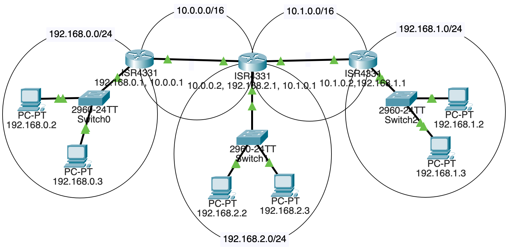
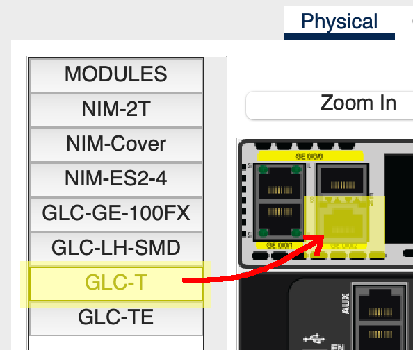

# Dự án: Packet Tracer: Nhiều Router

Trong dự án Packet Tracer trước, chúng ta có một router duy nhất nằm giữa hai
subnet. Trong dự án này, chúng ta sẽ có nhiều router (multiple routers) giữa các subnet.

Điều đó phức tạp hơn một chút, vì bảng định tuyến (routing table) của mỗi router cần
được chỉnh sửa để nó biết phải chuyển tiếp gói tin (forward packets) ra cổng nào.

Trên một mạng LAN lớn hơn, có thể dùng một giao thức cổng (gateway protocol) để
phân phối thông tin các router cần một cách nhanh chóng.

Nhưng trong trường hợp của chúng ta, để giữ mọi thứ đơn giản về mặt khái niệm, ta
sẽ tự cấu hình thủ công các tuyến đường trên từng router --- tổng cộng ba cái.

## Chúng Ta Đang Xây Dựng Gì

NĂM subnet!

* Ba cái là LAN:
  * `192.168.0.0/24`
  * `192.168.1.0/24`
  * `192.168.2.0/24`

* Hai cái nằm giữa các router:
  * `10.0.0.0/16`
  * `10.1.0.0/16`

Và đây là sơ đồ:



## Kéo Thả Các Thành Phần

Chúng ta sẽ cần:

* 2 PC mỗi LAN, vậy tổng cộng 6 PC
* 3 switch 2960
* 3 router 4331

Mỗi LAN kết nối với một router.

Hai trong số các router đó cũng kết nối với một router khác.

Nhưng, **và đây mới là phần thú vị**, router ở giữa kết nối với hai router khác
**và** một LAN nữa!

Dùng cáp đồng thẳng (straight-through copper) nối các thành phần lại như trong sơ
đồ trên.

## Cấu Hình Router Ở Giữa

Router ở giữa đó --- kết nối với hai router khác và một LAN? Mặc định nó không đủ
cổng. Ta cần thêm một cổng.

May thay đây là mô phỏng ảo, nên bạn được phép giả lập việc thanh toán cho linh kiện
mới mà không cần mở ví thật.

Chọn router đó rồi vào tab "Physical" (Vật lý).

Nhấn "Zoom In" để nhìn rõ hơn.

Công tắc nguồn nằm bên phải. Cuộn đến đó rồi nhấn vào. (Bạn không thể thêm linh
kiện khi router đang bật.)

Hai đầu nối Ethernet nằm ở góc trên bên trái. Ngay bên phải của chúng có thêm hai cổng
khác có thể cắm linh kiện vào.

Từ thanh bên trái, kéo một linh kiện "GLC-T" vào cổng phía dưới trong số các cổng
đó (có vẻ cổng trên không dùng được), như hình dưới đây:



Sau đó bật router lại.

## Cấu Hình Ba Subnet LAN

Dùng các dải địa chỉ subnet sau:

  * `192.168.0.0/24`
  * `192.168.1.0/24`
  * `192.168.2.0/24`

Theo quy ước, router thường nhận địa chỉ `.1` trên subnet của mình, ví dụ
`192.168.2.1`. Đây không phải yêu cầu bắt buộc.

Gán địa chỉ IP cho 2 PC và 1 router trong cùng một subnet. Kết nối tất cả vào một
switch.

Đảm bảo rằng cổng Ethernet đúng trên router đã được bật "On" trong phần cấu hình!

Kiểm tra nhanh: tất cả các máy tính trên cùng subnet phải có thể ping lẫn nhau **và**
ping được router của chúng.

## Đặt Default Gateway Cho Tất Cả PC

Nhớ lại rằng khi PC gửi lưu lượng đi, chúng hoặc biết đang gửi trong LAN (vì đích
nằm trong cùng LAN), hoặc không biết IP đó ở đâu. Nếu không nhận ra IP thuộc cùng
subnet, chúng gửi lưu lượng tới _cổng mặc định_ (default gateway) --- tức là router
biết phải làm gì với nó.

Nhấp vào từng PC. Dưới mục "Config" ở thanh bên "Global/Settings", đặt
"Default Gateway" tĩnh là IP của router trên LAN đó.

Ví dụ, nếu tôi đang ở PC `192.168.1.2` và router của tôi trên LAN đó là
`192.168.1.1`, tôi sẽ đặt default gateway của PC là `192.168.1.1`.

Thực ra, tôi sẽ đặt default gateway cho tất cả PC trên LAN đó đều về giá trị đó.

Làm tương tự cho hai LAN còn lại.

## Cấu Hình Các Subnet Router

Để định tuyến đúng, ta cần một subnet giữa router trái và router giữa, và một subnet
khác giữa router giữa và router phải.

Dùng các subnet sau:

  * `10.0.0.0/16`
  * `10.1.0.0/16`

Điều này có nghĩa là router trái và router phải sẽ có HAI địa chỉ IP vì chúng gắn
với hai subnet.

Còn router giữa sẽ có BA địa chỉ IP vì nó gắn với ba subnet! (Tức là một LAN và
hai router khác.)

Kết nối các subnet bằng cáp đồng thẳng nếu bạn chưa làm.

## Cấu Hình Bảng Định Tuyến

Gần xong rồi, nhưng nếu bạn đang ở `192.168.0.2` và thử ping `192.168.1.2`, lưu
lượng vẫn sẽ không đến được.

Lý do là router trên subnet `192.168.0.0/24` không biết gửi đi đâu để đến được
`192.168.1.2`.

Chúng ta phải nhập thông tin đó vào.

Ta sẽ thêm thủ công các "tuyến tĩnh" (static routes) vào từng router để chúng biết
phải gửi đến đâu. Như đã đề cập, trong thực tế, người ta thường dùng giao thức cổng
để tự động thiết lập các bảng định tuyến này.

Nhưng đây là phòng thí nghiệm --- thủ công mới vui chứ! (Thật ra làm tự động cũng
rất có ích, nhưng cách thủ công này _hữu ích hơn_ cho người mới bắt đầu.)

Hãy nhìn lại sơ đồ mạng:


Nếu một gói tin đến `192.168.1.2` (bên phải) xuất phát từ `192.168.0.3` bên trái,
nó sẽ đi qua đâu?

Ta thấy nó phải đi qua cả ba router. Nhưng khi đến router đầu tiên tại `192.168.0.1`
(router của LAN), router đó sẽ gửi nó đi đâu?

Từ đó, ta sẽ đi qua subnet `10.0.0.0/16` đến router `10.0.0.2`.

Vậy ta phải thêm một tuyến vào router ngoài cùng bên trái để nói: "Này, nếu mày
nhận được gì cho subnet `192.168.1.0/24`, hãy chuyển tiếp nó đến `10.0.0.2` vì đó
là bước nhảy tiếp theo (next hop)."

Ta làm điều này bằng cách nhấp vào router ngoài cùng bên trái, vào "Config", rồi
"Routing/Static" trên thanh bên trái.

Các trường "Network" và "Mask" là đích đến, "Next Hop" là router mà ta sẽ chuyển
tiếp lưu lượng tới.

Trong sơ đồ này, ta thêm một tuyến vào router ngoài cùng bên trái như sau (nhớ rằng
mạng `\24` có netmask `255.255.255.0`):

``` {.default}
Network:  192.168.1.0
Mask:     255.255.255.0
Next Hop: 10.0.0.2
```

Vậy là được một phần rồi! Nhưng, đáng tiếc và quan trọng, router giữa cũng không
biết gửi lưu lượng cho `192.168.1.0/24` đi đâu.

Vậy ta phải thêm một tuyến vào router giữa để gửi nó tới bước nhảy tiếp theo, lần
này qua interface `10.1.0.0/16` của nó:

``` {.default}
Network:  192.168.1.0
Mask:     255.255.255.0
Next Hop: 10.1.0.2
```

Và bây giờ ta đến đích rồi! Router có IP `10.1.0.2` có một interface kết nối với
`192.168.1.0/24`. Gói tin gốc của ta đang đi tới `192.168.1.2`, và nó nằm trong
cùng subnet! Router biết nó chỉ cần gửi lưu lượng ra interface đó là xong.

Tất nhiên, đó chưa phải là tất cả những gì ta cần làm.

Thêm các mục vào bảng định tuyến cho tất cả các subnet không kết nối trực tiếp vào
mỗi router.

Mỗi router cần có hai mục tuyến tĩnh để tất cả lưu lượng vào ra đều được xử lý.

## Kiểm Tra Thôi!

Nếu mọi thứ được cấu hình đúng, bạn sẽ có thể ping bất kỳ PC nào từ bất kỳ PC nào
khác! Các router sẽ chuyển tiếp lưu lượng đến các LAN khác!

<!-- Rubric

15
All three LANs set up correctly

15
All three routers connected correctly with proper subnets

18
All three routing tables set up correctly

-->
